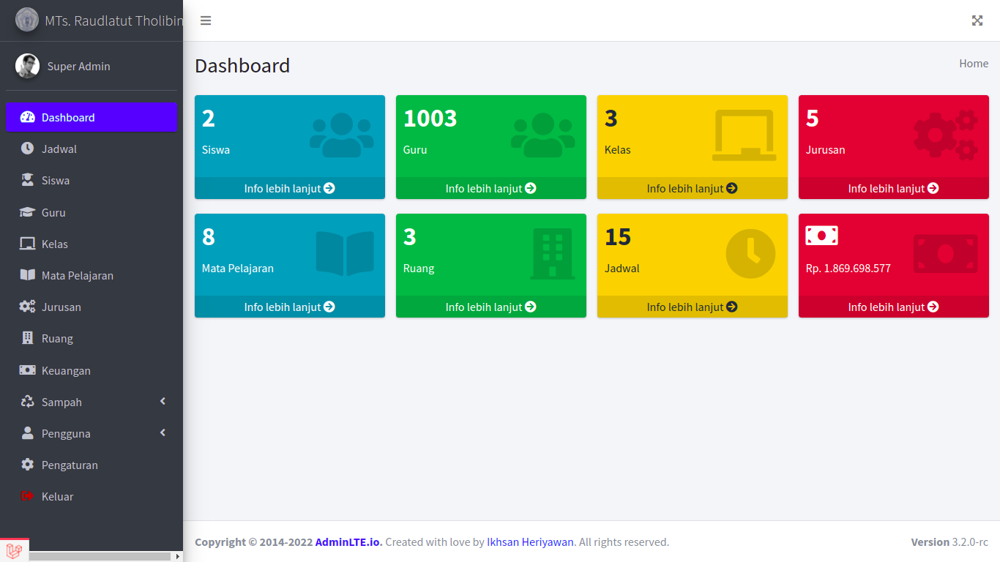
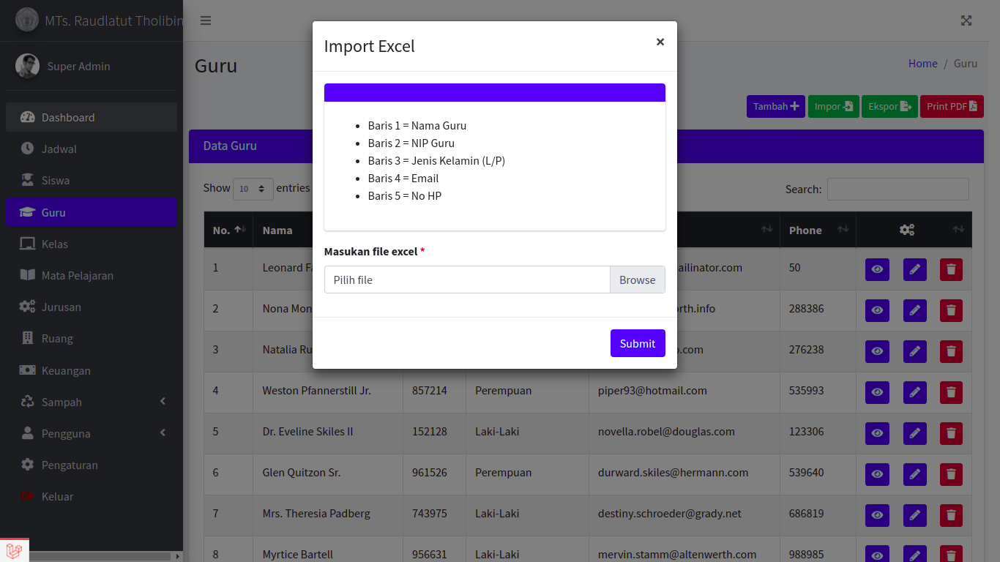
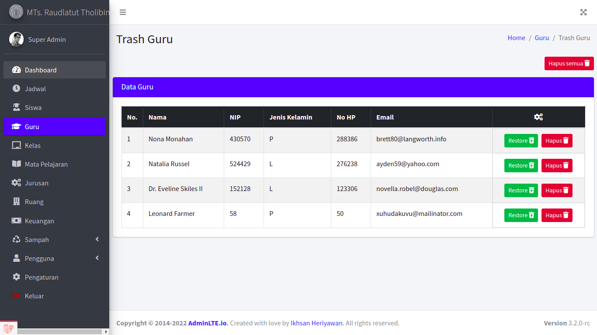
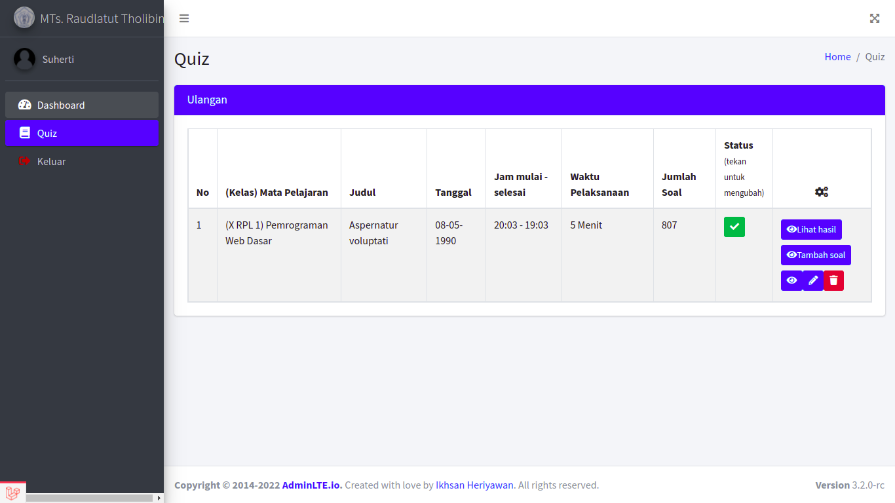
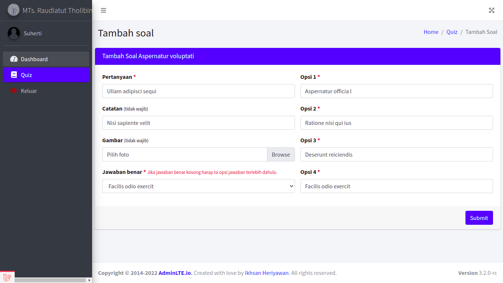
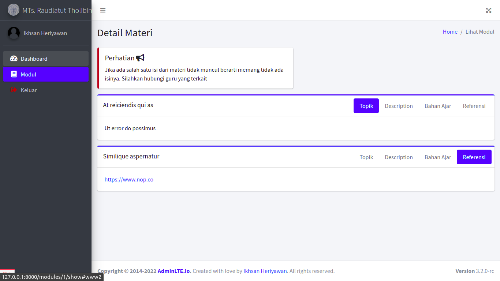

# Learning Management System

Learning Management System for SMK or SMA.

### Features include: 

- CRUD User
- Management role and permission users
- CRUD Teacher
- Import & export excel Teacher
- Print PDF Teacher
- CRUD Student
- Import & export excel Student
- Print PDF Student
- CRUD Schedule
- Print PDF Schedule
- CRUD Class
- CRUD Study
- CRUD Major
- CRUD Room
- CRUD Finance
- Print excel or pdf Finance
- Soft delete every module


## Visuals







## Installation

```bash
composer install
cp .env.example .env
php artisan key:generate
php artisan storage:link
php artisan migrate:fresh --seed
```

## Configuration

add this line in your .env file
```php
FILESYSTEM_DRIVER=public
```
### Users
- Super Admin
- Email : superadmin@role.test
- Password : admin
- Teacher
- Email : suherti@mail.test
- Password : 1900032
- Student
- Email : ikhsan@gmail.com
- Password : 1900032

### Important
if you want to add feature default avatar image for users you can follow these steps
- login to user has registered via seeder
- edit user image
- put your image default in directory /storage/app/public/img/profiles/
- and rename to 'irp-logo.png'

You can see details in my youtube video https://www.youtube.com/watch?v=S-xPWSIBIhY&t=4s

## Contributing
Pull requests are welcome. For major changes, please open an issue first to discuss what you would like to change.

Please make sure to update tests as appropriate.

## License
[MIT](https://choosealicense.com/licenses/mit/)
